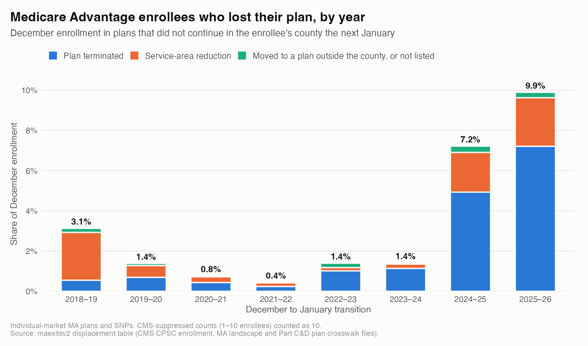

# maexitsv2: Medicare Advantage plan exits

An R package that measures how many Medicare Advantage (MA) enrollees lose their plan each year, and why. It builds its data from public CMS files: plan-by-county enrollment, the MA landscape, and the Part C&D Plan Crosswalk, which says what becomes of each plan the next January. Terminations and service-area reductions are kept apart from renewals and consolidations.



<details>
<summary>Figure data</summary>

| Transition | Lost their plan | Share of December enrollment (%) | Plan terminated | Service-area reduction | Moved to a plan outside the county, or not listed |
|---|--:|--:|--:|--:|--:|
| 2018–19 | 529,048 | 3.13 | 0.55 | 2.38 | 0.20 |
| 2019–20 | 252,962 | 1.39 | 0.69 | 0.59 | 0.11 |
| 2020–21 | 153,419 | 0.76 | 0.44 | 0.28 | 0.04 |
| 2021–22 | 99,894 | 0.44 | 0.24 | 0.18 | 0.03 |
| 2022–23 | 343,848 | 1.40 | 1.02 | 0.16 | 0.22 |
| 2023–24 | 377,253 | 1.40 | 1.14 | 0.21 | 0.05 |
| 2024–25 | 2,053,458 | 7.22 | 4.93 | 1.97 | 0.31 |
| 2025–26 | 2,936,310 | 9.89 | 7.21 | 2.41 | 0.27 |

Drawn from the `displacement` table by [`tools/readme-figure.R`](tools/readme-figure.R).
</details>

## Install and load

```r
# install.packages("remotes")
remotes::install_github("MatthewLavallee/maexits")
library(maexitsv2)

maexits_catalog()                                  # every dataset and variable

# One row per December plan x county; downloads once, then cached
d <- maexits_data("displacement", years = 2025)    # December 2025 -> January 2026
d[, sum(dec_enrollment[lost_coverage]) / sum(dec_enrollment)]   # share who lost their plan
d[lost_coverage == TRUE, .(people = sum(dec_enrollment)), by = outcome]

maexits_data("county_panel", years = 2024:2025, states = "MD")
maexits_data("plan_details", plans = "H2001", years = 2026)
cms_enrollment("2026-09", states = "MD", ma_only = TRUE)  # any CMS month since Dec 2019
```

Loaders filter by `plans`, `states`, `counties`, `years` (`months` for enrollment) and `variables`. A transition is indexed by its December: `dec_year` 2025 is December 2025 to January 2026.

## Datasets

| Dataset | One row per | Contents |
|---|---|---|
| `displacement` | December plan × county | January outcome, lost coverage, whether the plan, contract or parent left, the county's plans next January, plan details |
| `plan_details` | plan × segment × year | organization and parent, premiums, deductible, out-of-pocket maximum, star ratings, SNP details |
| `county_panel` | county × year | exit rate, displaced enrollment, December and January enrollment, 2018 penetration, benchmark |
| `plan_county` | crosswalk link × county × year | crosswalk status, December and January enrollment, exit flags |
| `landscape` | plan × segment × county × year | service areas (CY2016 on), plan type, SNP type |
| `enrollment` | plan × county × month | the December and January enrollment the pipeline uses |

Each dataset has a help page (`?displacement`), and [DATA_DICTIONARY.md](DATA_DICTIONARY.md) defines every column.

- **Counting.** `displacement` has one row per plan-county, so sums count each enrollee once. `plan_county` has one row per crosswalk link, so a plan's enrollment can repeat across rows; its `_once` columns, and `county_panel`'s, count each plan-county once. The `counting` column of `maexits_catalog()` flags every such column.
- **Suppressed counts.** CMS suppresses counts under 11. In `displacement`, `plan_county` and `county_panel` each suppressed cell counts as 10, and the `_low` columns count it as 1. `enrollment` leaves them out of its totals and counts them in `n_suppressed`.
- **Plan universe.** Individual-market MA plans and SNPs; standalone drug plans, Medicare-Medicaid Plans and employer group plans are excluded. `enrollment` and `cms_enrollment()` hold every plan in the CMS files.

## Building the data

The tables come from the GitHub release [`data-2018-2025`](https://github.com/MatthewLavallee/maexits/releases/tag/data-2018-2025) and are rebuilt from the CMS and NBER files with `run_data_pipeline()`. [PIPELINE.md](PIPELINE.md) covers the source files, the build, the yearly update and `check_cms_releases()`, which reports when CMS posts next year's files.

MIT license.
